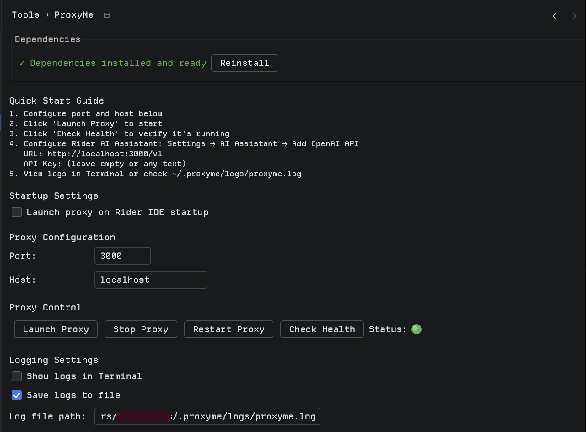
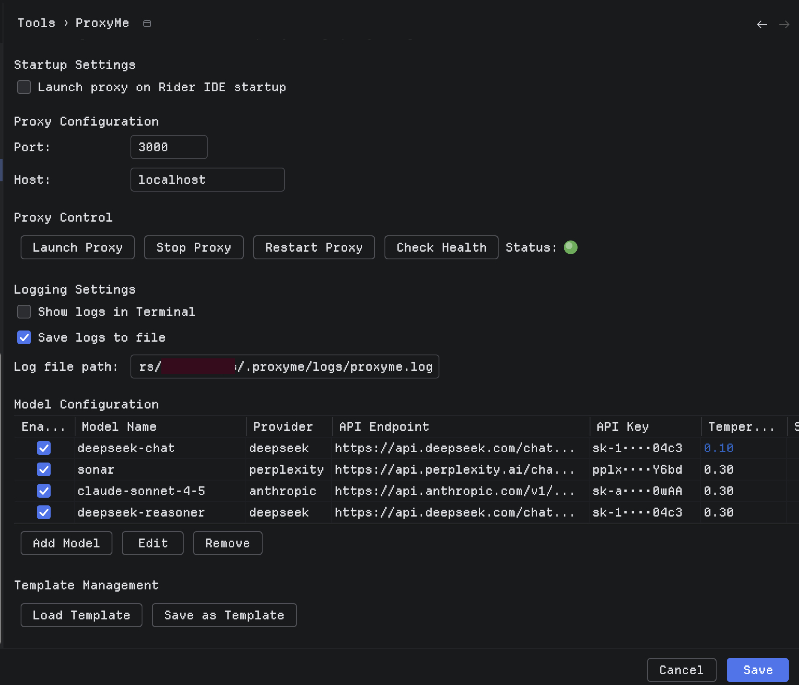
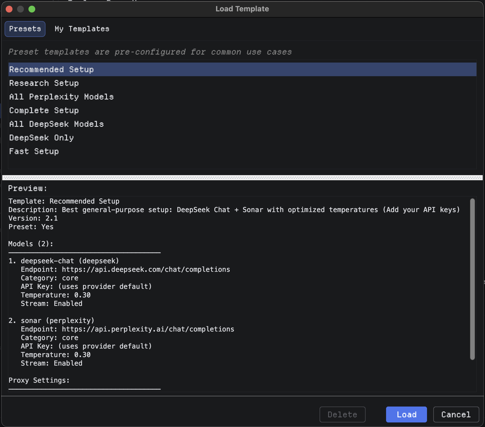
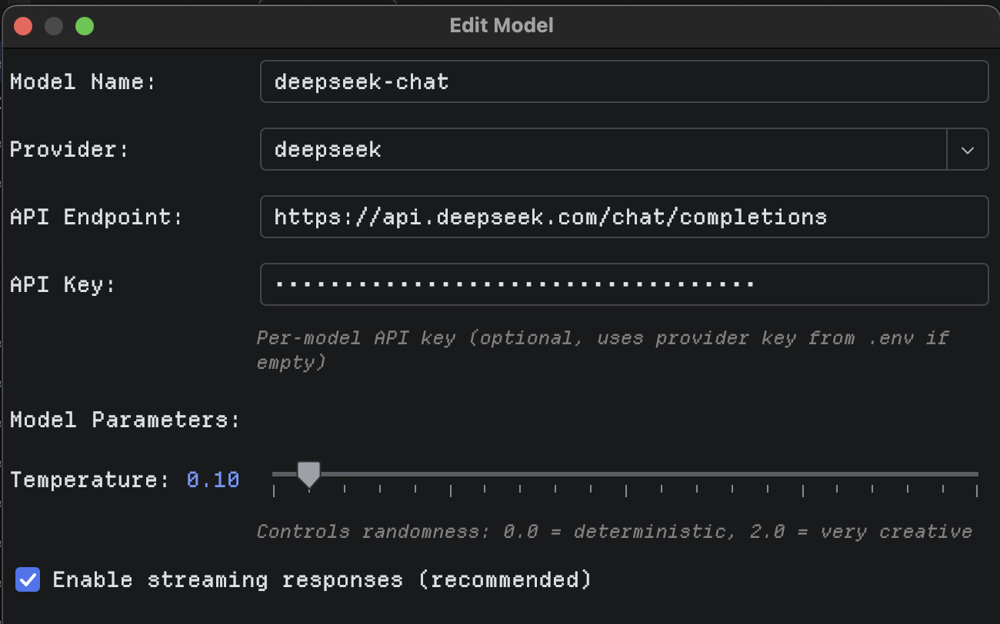
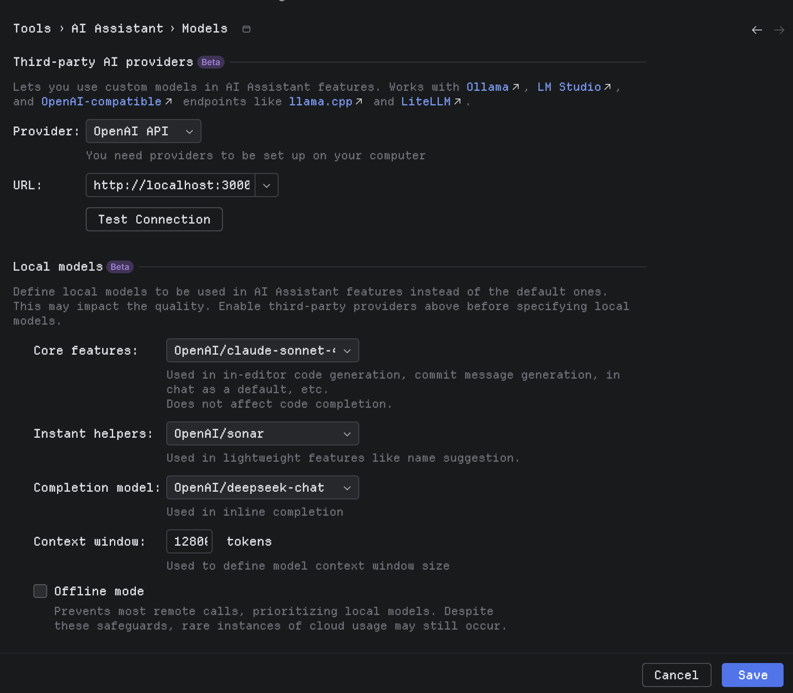

# ProxyMe

**AI Proxy Management Plugin for JetBrains Rider IDE**

[](https://github.com/native-apps/proxyme/releases)
[](LICENSE)
[](https://www.jetbrains.com/rider/)

ProxyMe is a comprehensive control panel plugin that lets you manage local AI proxy servers directly from JetBrains Rider IDE. Configure multiple AI models, control which models are available to Rider's AI Assistant, and manage API keys securely.

---

## ⚠️ Important Notices

**ALPHA SOFTWARE:** This plugin is in active development and contains AI-generated code (Claude Sonnet 4.5). Expect bugs and rough edges.

**ONLY TESTED WITH RIDER:** This plugin has only been tested with JetBrains Rider IDE. Use with other JetBrains IDEs at your own risk.

**KNOWN ISSUES:**
- Occasional crashes when restarting proxy (improved in v2.1.0+)
- Code needs refactoring and optimization
- Security review needed for API key handling

**WE NEED YOUR HELP:** This project is now community-driven. Contributions welcome for code quality, security fixes, testing, and documentation.

---

## Features

### 🎯 Dynamic Model Control
- **Only enabled models appear in Rider AI Assistant** - No more cluttered model lists!
- Enable/disable models individually
- Configure which AI models Rider can actually use
- Auto-generates configuration file for the proxy

### ⚙️ Per-Model Configuration
- **Temperature control** (0.0 - 2.0) - Set creativity level per model
- **Streaming toggle** - Enable/disable real-time responses
- Custom API endpoints
- Secure API key management

### 🚀 Proxy Server Management
- Launch, stop, and restart proxy from IDE
- Real-time status monitoring (🟢🟠🔴 LED indicator)
- Custom port and host configuration
- Auto-launch on IDE startup

### 🔐 Security & Privacy
- API keys stored in `~/.proxyme/` (outside project directory)
- Never committed to version control
- Environment files auto-generated
- Project-specific isolation

### 📋 Template System
- Save configurations as reusable templates
- Built-in presets (DeepSeek, Perplexity, Claude)
- Import/export templates
- Quick setup for common scenarios

### 📊 Logging & Monitoring
- View logs directly in Rider Terminal
- Dedicated log files in `~/.proxyme/logs/`
- Health check endpoints
- Debug and error tracking

---

## Quick Start

### Prerequisites

- **JetBrains Rider** 2024.3 or later
- **Node.js** v18 or later
- **Java 17+** (for building from source)

### Installation

#### Option 1: Install Pre-built Plugin (Recommended)

1. **Download the latest release:**
   - Visit [Releases](https://github.com/native-apps/proxyme/releases)
   - Download `ProxyMe-2.1.0.zip`

2. **Install in Rider:**
   ```
   File → Settings → Plugins → ⚙️ → Install Plugin from Disk...
   ```
   - Select the downloaded ZIP file
   - Click OK and restart Rider

3. **Verify installation:**
   - Check `Tools` menu for `ProxyMe`

#### Visual Installation Guide

**Step 1: Install Dependencies**



The main settings panel shows dependency status. Click "Reinstall" if needed to install Node.js dependencies.

**Step 2: Configure Log Directory**



Configure your local user directory for logs and set up the proxy server settings. The model configuration table shows your enabled AI models.

**Step 3: Use Prebuilt Templates**



Load prebuilt templates for quick setup or create your own custom templates. Preview shows the configuration before loading.

**Step 4: Add Your Own Model (BYOK)**



Bring Your Own Key (BYOK) - Add custom AI models with your API keys. Configure temperature and streaming options per model.

**Step 5: Configure Rider AI Assistant**



Configure Rider's AI Assistant to connect to ProxyMe proxy server at `http://localhost:3000/v1`. Click "Test Connection" to refresh available models.

#### Option 2: Build from Source

See [BUILD.md](BUILD.md) for detailed instructions.

```bash
git clone https://github.com/native-apps/proxyme.git
cd proxyme
./gradlew buildPlugin
```

### First-Time Setup

1. **Open ProxyMe Settings:**
   ```
   Tools → ProxyMe
   ```

2. **Add your first AI model:**
   - Click `Add Model`
   - Enter model details (name, provider, endpoint, API key)
   - Set temperature (recommended: 0.3 for coding)
   - Enable streaming
   - Click OK

3. **Enable the model:**
   - Check the box in the `Enabled` column
   - Click `Save`

4. **Launch the proxy:**
   ```
   Tools → ProxyMe → Launch Proxy Server
   ```
   - Status indicator turns green 🟢

5. **Configure Rider AI Assistant:**
   ```
   Settings → Tools → AI Assistant → Models
   ```
   - Provider: `OpenAI API`
   - URL: `http://localhost:3000/v1`
   - API Key: (leave empty)
   - Click `Test Connection`

6. **Assign models to features:**
   - Core features: Select your preferred model
   - Instant helpers: Select a fast, focused model
   - Completion model: Select a precise model

**Done!** Start using AI features in Rider.

---

## Recommended Settings

### Temperature Guide

Temperature controls response creativity:

- **0.1 - 0.3** → Focused, precise, deterministic (recommended for code)
- **0.4 - 0.7** → Balanced, good for general chat
- **0.8 - 2.0** → Creative, exploratory (use sparingly)

**Default: 0.3** for coding tasks

### Model Assignment in Rider

| Feature | Recommended Model | Temperature | Why |
|---------|------------------|-------------|-----|
| **Core features** | `deepseek-chat` or `sonar` | 0.3-0.5 | Main coding and chat |
| **Instant helpers** | `deepseek-chat` | 0.1-0.3 | Quick edits, precise |
| **Completion** | `deepseek-chat` | 0.2-0.3 | Inline completion |

**Avoid:**
- ❌ Search models (Sonar) for Quick Edit - tends to edit multiple files
- ❌ High temperatures (>0.7) for code - causes unfocused edits
- ❌ Reasoning models for simple tasks - overkill and slower

---

## Documentation

- **[Installation Guide](INSTALL.md)** - Detailed installation steps
- **[Build Instructions](BUILD.md)** - How to build from source
- **[Troubleshooting](TROUBLESHOOTING.md)** - Common issues and solutions
- **[Contributing Guidelines](CONTRIBUTING.md)** - How to contribute
- **[Roadmap](ROADMAP.md)** - Future plans and versions
- **[Full Documentation](docs/README.md)** - Complete documentation library

---

## How It Works

### Architecture

```
┌─────────────────────────────────────────┐
│         Rider IDE with ProxyMe          │
│                                         │
│  ┌───────────────────────────────────┐ │
│  │   ProxyMe Plugin (Settings UI)    │ │
│  │   - Configure models              │ │
│  │   - Manage API keys               │ │
│  │   - Control proxy lifecycle       │ │
│  └──────────────┬────────────────────┘ │
│                 │                       │
│                 │ generates             │
│                 ▼                       │
│  ┌─────────────────────────────┐      │
│  │  ~/.proxyme/proxy/          │      │
│  │  - models.json              │      │
│  │  - .env (API keys)          │      │
│  └──────────────┬──────────────┘      │
└─────────────────┼───────────────────────┘
                  │
                  │ launches
                  ▼
      ┌───────────────────────┐
      │   Node.js Proxy       │
      │   (localhost:3000)    │
      │   - Reads models.json │
      │   - Loads API keys    │
      │   - Handles requests  │
      └──────────┬────────────┘
                 │
                 │ forwards to
                 ▼
      ┌─────────────────────────┐
      │   AI Provider APIs      │
      │   - DeepSeek            │
      │   - Perplexity          │
      │   - Anthropic           │
      │   - OpenAI              │
      │   - Custom providers    │
      └─────────────────────────┘
```

### Key Concepts

**ProxyMe's Role:**
- Controls which models are **available**
- Manages API keys and endpoints
- Configures temperature and streaming
- Generates `models.json` for proxy

**Rider AI Assistant's Role:**
- Controls which models are **assigned** to features
- Decides which model for chat vs. completion vs. helpers
- Native Rider UI and functionality

**Clear Separation:**
1. Configure models in ProxyMe → Save → Generates config
2. Restart proxy → Loads only enabled models
3. Assign models in Rider AI Assistant → Use in IDE

---

## Configuration Files

ProxyMe stores configuration in your home directory (never in project files):

```
~/.proxyme/
├── proxy/
│   ├── .env              # API keys (NEVER committed)
│   ├── models.json       # Enabled models configuration
│   ├── proxy.js          # Proxy server code
│   └── package.json      # Node.js dependencies
├── logs/
│   └── proxyme.log       # Application logs
└── templates/
    ├── presets/          # Built-in templates
    └── user/             # Your custom templates
```

---

## Supported AI Providers

- **DeepSeek** - Fast, efficient coding models
- **Perplexity** - Search-augmented AI (Sonar models)
- **Anthropic** - Claude models (3.5 Sonnet, Opus, etc.)
- **OpenAI** - GPT models (requires API key)
- **Custom** - Any OpenAI-compatible API

---

## Contributing

**We need your help!** This project contains AI-generated code and needs:

- 🐛 Bug fixes and stability improvements
- 🔒 Security review and hardening
- 🧪 Testing and quality assurance
- 📖 Documentation improvements
- ✨ New features and enhancements
- 🧹 Code refactoring and cleanup

See [CONTRIBUTING.md](CONTRIBUTING.md) for guidelines.

### Areas That Need Help

**High Priority:**
- Security review of API key handling
- Error handling and recovery
- Testing (unit and integration tests)
- Performance optimization
- Stability fixes

**Code Quality:**
- Refactor AI-generated code
- Add comprehensive comments
- Improve type safety
- Better logging

**Features:**
- Support for more AI providers
- Expanded preset library
- UI/UX improvements
- Better health monitoring

---

## Support

- 🐛 **Bug Reports:** [GitHub Issues](https://github.com/native-apps/proxyme/issues)
- 💬 **Discussions:** [GitHub Discussions](https://github.com/native-apps/proxyme/discussions)
- 📖 **Documentation:** [Full Docs](docs/README.md)
- 🔧 **Troubleshooting:** [Guide](TROUBLESHOOTING.md)

---

## Roadmap

See [ROADMAP.md](ROADMAP.md) for detailed plans.

**Upcoming:**
- Stability and bug fixes
- Security improvements
- Testing with other JetBrains IDEs
- More AI provider integrations
- UI/UX enhancements
- Plugin marketplace release

---

## License

MIT License - See [LICENSE](LICENSE) file for details.

---

## Acknowledgments

- Created with assistance from Claude Sonnet 4.5 (yes, AI helped build an AI tool!)
- Built for the JetBrains Rider community
- Inspired by the need for better AI model management in IDEs

---

## Disclaimer

**Use at your own risk.** This is alpha software with known issues. Always:
- Back up your work before using
- Review generated code carefully
- Test in non-production environments first
- Keep API keys secure
- Monitor usage and costs

---

**Ready to get started?** 

📦 [Download the latest release](https://github.com/native-apps/proxyme/releases) | 📖 [Read the docs](docs/README.md) | 🤝 [Contribute](CONTRIBUTING.md)

---

*Made with ❤️ by the community, for the community*